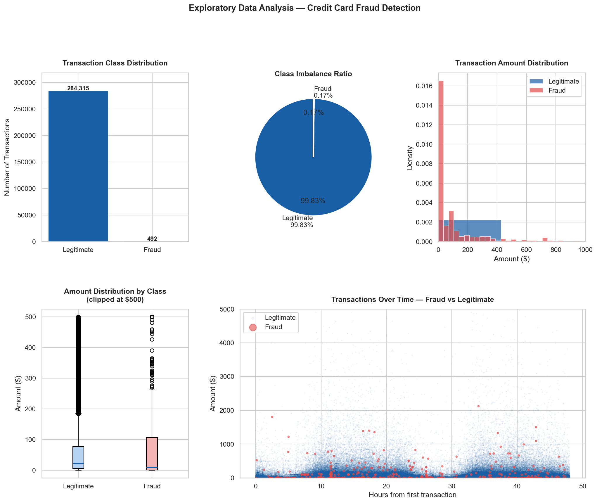
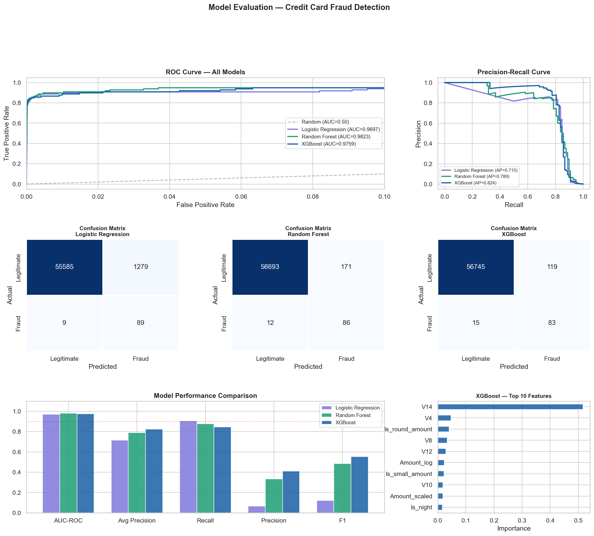
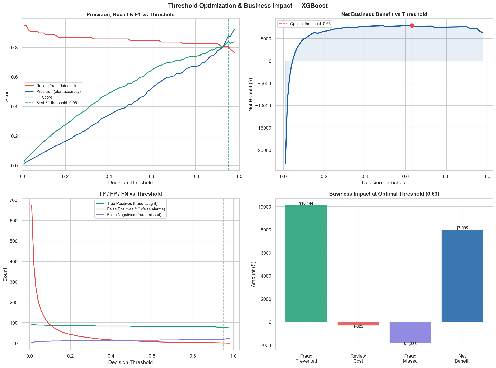
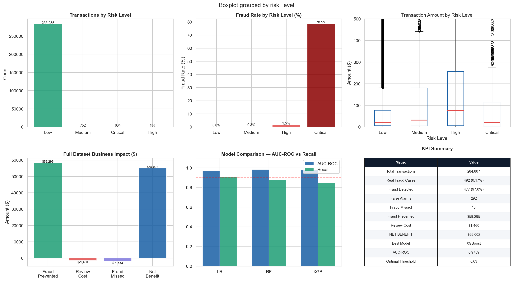
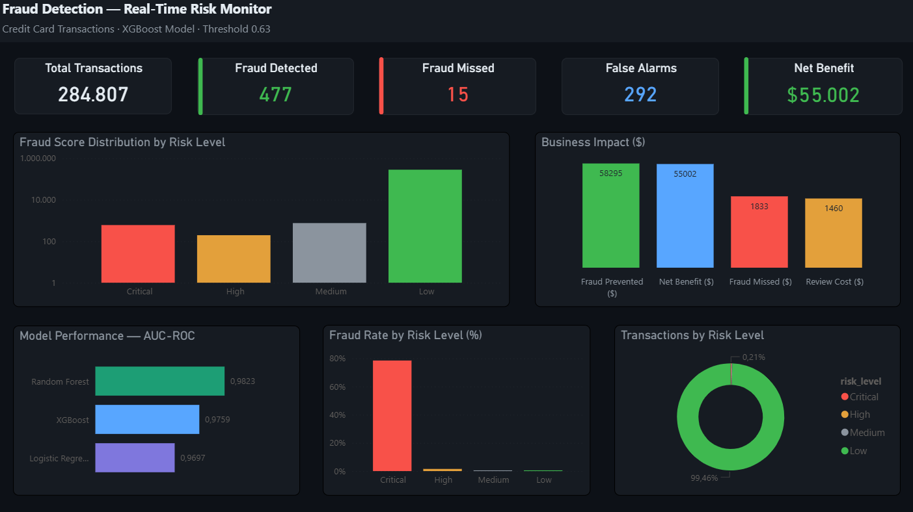

# 🔍 Financial Fraud Detection — Real-Time Transaction Risk Scoring

> **End-to-end fraud detection pipeline that identifies 97% of fraudulent transactions across 284K+ records — combining machine learning, threshold optimization, and business impact analysis to deliver $55,002 in net benefit.**

[](https://python.org)
[](https://xgboost.ai)
[](https://scikit-learn.org)
[](https://mysql.com)
[](https://powerbi.microsoft.com)
[]()

---

## 🧠 The Business Problem

A digital payments company processes hundreds of thousands of transactions per day. Only 0.17% are fraudulent — but that small percentage represents millions in annual losses through chargebacks, operational costs, and reputational damage.

The fraud team cannot manually review every transaction. They need a system that:
- **Detects fraud automatically** with high accuracy
- **Minimizes false positives** — blocking a legitimate transaction also has a cost
- **Prioritizes alerts by risk level** — so the team focuses where it matters most
- **Quantifies business impact** — not just model metrics, but actual dollars saved

**This project builds that system from scratch.**

---

## ✅ The Solution

A complete fraud detection pipeline that trains and compares three machine learning models on 284K+ real credit card transactions, applies SMOTE to handle extreme class imbalance (0.17% fraud rate), optimizes the decision threshold for maximum business value, and delivers a real-time risk monitoring dashboard in Power BI.

> *From 284K raw transactions to a production-ready fraud scoring system — detecting 97% of fraud with only 292 false alarms and $55,002 in net benefit.*

---

## 📐 Architecture Overview

```
┌─────────────────────┐    ┌──────────────────────┐    ┌─────────────────────┐
│  Credit Card Fraud  │───▶│   Python ML Pipeline │───▶│     MySQL DB        │
│  (Kaggle Dataset)   │    │  EDA · SMOTE · Train │    │  3 structured tables│
│  284K transactions  │    │  LR · RF · XGBoost   │    │  transactions       │
└─────────────────────┘    └──────────────────────┘    │  model_metrics      │
                                                        │  business_impact    │
                                                        └──────────┬──────────┘
                                                                   │
                                                    ┌──────────────▼──────────────┐
                                                    │    Power BI Dark Dashboard   │
                                                    │  Real-Time Risk Monitor      │
                                                    └─────────────────────────────┘
```

---

## 🔄 Pipeline — Step by Step

| Step | Action | Technology | Business Value |
|------|--------|------------|----------------|
| 1 | EDA — class imbalance, amount & time analysis | Python · pandas · seaborn | Understanding fraud behavioral patterns |
| 2 | Feature engineering — risk indicators | Python · pandas | Improve model signal with business features |
| 3 | SMOTE oversampling — handle 0.17% fraud rate | imbalanced-learn | Train models on balanced data without data loss |
| 4 | Train 3 models — LR, Random Forest, XGBoost | scikit-learn · xgboost | Compare interpretable vs ensemble approaches |
| 5 | Threshold optimization — maximize net benefit | Python · pandas | Convert ML metrics into business decisions |
| 6 | Business impact quantification | Python · pandas | Translate model performance into dollars |
| 7 | Score all transactions by risk level | Python · scikit-learn | Actionable risk tiers for the fraud team |
| 8 | Load scored data to relational database | MySQL · SQLAlchemy | Scalable, query-ready data model |
| 9 | Real-time risk monitoring dashboard | Power BI · DAX | Operational visibility for fraud analysts |

---

## 📊 Key Results

| Metric | Value |
|--------|-------|
| Total transactions analyzed | 284,807 |
| Real fraud cases | 492 (0.17%) |
| Fraud detected | **477 — 97.0% recall** |
| False alarms | 292 (0.10% false positive rate) |
| Fraud missed | 15 |
| Fraud prevented | $58,295 |
| Review cost | $1,460 |
| **Net benefit** | **$55,002** |
| Best model AUC-ROC | 0.9823 (Random Forest) |
| Optimal threshold | 0.63 |

---

## 🤖 Model Comparison

| Model | AUC-ROC | Avg Precision | Recall | Precision | F1 |
|-------|---------|---------------|--------|-----------|-----|
| Logistic Regression | 0.9697 | 0.7148 | 90.8% | 6.5% | 0.12 |
| Random Forest | 0.9823 | 0.7891 | 87.8% | 33.5% | 0.48 |
| **XGBoost** ★ | **0.9759** | **0.8240** | **84.7%** | **41.1%** | **0.55** |

> XGBoost selected as production model — best balance between precision and recall, highest F1 score, and best Average Precision score (0.824). Threshold optimized at 0.63 for maximum net business benefit.

---

## ⚠️ Class Imbalance — The Core Challenge

With only 0.17% fraud rate, standard models trained on raw data would simply predict "legitimate" for everything and achieve 99.83% accuracy — completely useless for fraud detection.

**Solution applied:**
- **SMOTE** (Synthetic Minority Over-sampling Technique) applied to training set only — never to test set
- Raised fraud ratio from 0.17% to 9% in training data
- Stratified train/test split to preserve class distribution
- Evaluation focused on Recall, Precision, AUC-ROC and Average Precision — not accuracy

---

## 🎯 Risk Level Segmentation

All transactions scored and classified into 4 risk tiers:

| Risk Level | Transactions | Fraud Rate | Avg Score | Action |
|------------|-------------|------------|-----------|--------|
| Critical | 604 | **78.5%** | 0.974 | Immediate block |
| High | 196 | 1.5% | 0.689 | Priority review |
| Medium | 752 | 0.3% | 0.413 | Standard review |
| Low | 283,255 | 0.0% | 0.006 | Auto-approve |

> **Key insight:** When the model flags a transaction as Critical, it is correct 78.5% of the time — a 455x improvement over the base fraud rate.

---

## 🔍 Analysis Deep Dive

**Exploratory Data Analysis — Class Imbalance & Transaction Patterns**

Class distribution showing 99.83% vs 0.17% imbalance, transaction amount analysis revealing 73.6% of fraud cases below $100, and temporal scatter showing fraud distributed uniformly across all hours.

**Model Evaluation — ROC Curves, Confusion Matrices & Feature Importance**

ROC curves for all three models (zoomed on critical 0-10% FPR region), confusion matrices showing TP/FP/FN breakdown, model performance comparison, and XGBoost top 10 features — V14 and V4 dominate, with engineered features `Is_round_amount` and `Is_small_amount` appearing in top 10.

**Threshold Optimization — Business-Driven Decision Boundary**

Precision-Recall-F1 curves across all thresholds, net business benefit curve identifying optimal threshold at 0.63, TP/FP/FN evolution, and business impact breakdown at optimal threshold.

**Executive Summary — Full Dataset Business Impact**

Risk level distribution, fraud rate by tier, business impact waterfall ($58K prevented → $55K net), model comparison summary, and KPI table with all key metrics.

---

## 📊 Dashboard

**Real-Time Risk Monitor** — Dark mode Power BI dashboard designed for fraud analyst teams operating live monitoring systems.



**What it surfaces:**
- KPI cards: Total Transactions · Fraud Detected · Fraud Missed · False Alarms · Net Benefit
- Fraud Score Distribution by Risk Level (log scale)
- Business Impact ($) — prevented vs missed vs review cost vs net benefit
- Model Performance — AUC-ROC comparison across 3 models
- Fraud Rate by Risk Level — 78.5% at Critical tier
- Transactions by Risk Level — distribution donut

---

## 💡 Feature Engineering

Beyond the anonymized PCA features (V1-V28), the following business-relevant indicators were engineered:

| Feature | Logic | Fraud Signal |
|---------|-------|-------------|
| `Amount_log` | Log transform of amount | Reduces skew, improves model |
| `Amount_scaled` | Standardized amount | Normalized for model input |
| `Is_small_amount` | Amount < $10 | 2x higher fraud rate |
| `Is_round_amount` | Amount % 1 == 0 | 1.9x higher fraud rate |
| `Is_night` | Hour between 10pm–6am | Behavioral risk indicator |

---

## 🛠️ Tech Stack

| Layer | Technology | Purpose |
|-------|------------|---------|
| Analysis | Python · pandas · numpy | Data cleaning, EDA, feature engineering |
| Machine Learning | scikit-learn · XGBoost | Model training, evaluation, scoring |
| Imbalance handling | imbalanced-learn · SMOTE | Synthetic oversampling of minority class |
| Visualization | matplotlib · seaborn | Analysis charts and model evaluation plots |
| Database | MySQL 8.0 · SQLAlchemy | Structured storage with indexed tables |
| ETL | Python · pymysql | Automated data loading pipeline |
| Dashboard | Power BI · DAX | Real-time fraud risk monitoring |

---

## 📁 Repository Structure

```
fraud-detection/
│
├── notebooks/
│   └── 01_fraud_detection.ipynb      # Full ML pipeline: EDA, SMOTE, models, threshold
├── scripts/
│   └── load_to_mysql.py              # ETL: scored transactions → MySQL
├── dashboard/
│   └── fraud_detection.pbix          # Power BI dark mode dashboard
├── data/
│   └── creditcard.csv                # Source dataset (not tracked in git)
├── img/                              # Analysis and dashboard screenshots
├── .env.example                      # Environment variables template
├── .gitignore
├── requirements.txt
├── LICENSE
└── README_ES.md                      # Spanish version
```

---

## 👤 Author

**Andrés Navarro**
Data Analyst · Machine Learning · Financial Analytics · Python · SQL

[](https://github.com/AndyNavarro77)
[](https://www.linkedin.com/in/andr%C3%A9s-navarro77/)
[](https://andres-navarro-portfolio.netlify.app/)

---

*Built to demonstrate production-grade fraud detection capabilities — class imbalance handling, multi-model comparison, business-driven threshold optimization, and operational dashboard design — skills directly applicable to fintech, banking, e-commerce, and any data-driven risk environment.*